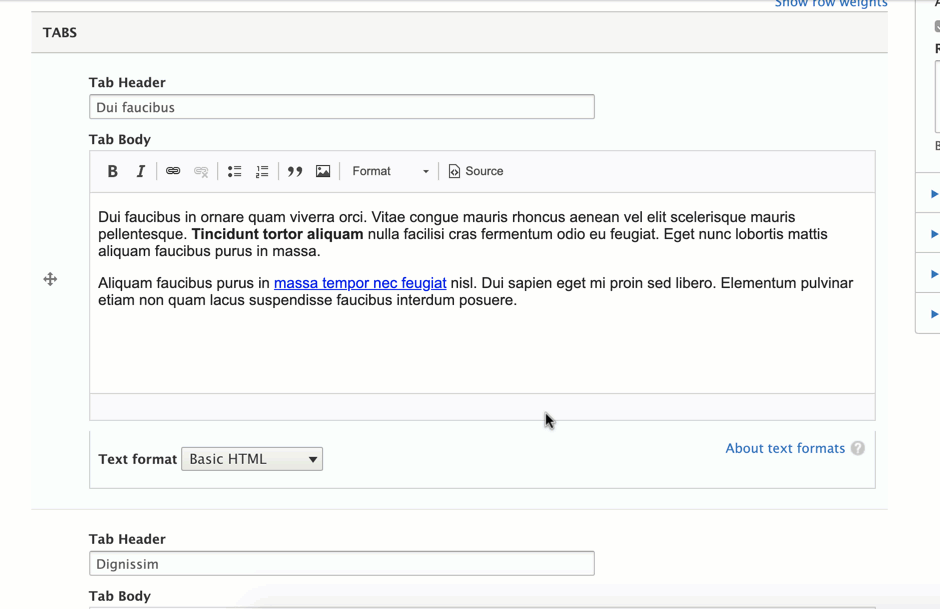

# Bootstrap Horizontal Tabs

This module provides a field type called "Horizontal Tabs" which consists of
tab label and tab body elements. The number of allowed tabs can be set when
adding the field to an entity. Tab labels can be set to display as either
traditional tabs or as pill buttons.

This module depends on the [Bootstrap framework](https://getbootstrap.com/).
It does not prescribe how Bootstrap should be integrated with the site, but
presumes that it *is* integrated and that the required elements render on all
page loads.

## Table of contents

- Requirements
- Installation & management in the UI
- Configuration
- Limitations/Scope
- Maintainers

## Requirements

- Bootstrap 3 or 4, including tab Javascript utilities

The simplest way to integrate the required Bootstrap components is to use or
sub-theme the Bootstrap Drupal theme (whose current stable version uses
Bootstrap version 3).

If using with Bootstrap 4, you will need to include the `util.js` and `tab.js`
components. See [JavaScript behavior](https://getbootstrap.com/docs/4.0/components/navs/#javascript-behavior)

## Installation & management in the UI

- After enabling this module, go to an entity's "Manage fields" page and click on
  "Add field"
- A new field type, "Horizontal Tabs," will be available
- Follow standard Drupal field steps for adding the field
- Under the "Manage Display" page, choose whether the tab headers should display
  as standard "Tabs" or "Pill buttons"

## Configuration

There is no configuration.

## Maintainers

Current maintainers:

- UT Austin - [University of Texas at Austin](https://www.drupal.org/university-of-texas-at-austin)

This project has been sponsored by:

- [The University of Texas at Austin](https://www.drupal.org/university-of-texas-at-austin)
